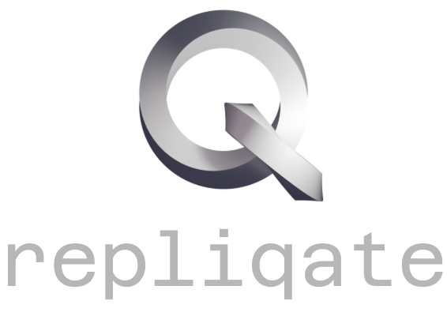

<p align="center">
    
</p>

<p align="center">
    
    
</p>

<p align="center">
    <a href="https://hub.docker.com/r/lminlone/repliqate">
        
    </a>
    
</p>

Repliqate is a modular backup solution designed for Docker environments. It safely handles containerized workloads by stopping and restarting containers during backup operations, ensuring data consistency.

Currently, Repliqate integrates with Restic as its backup engine, with planned support for additional providers in the future.

# Features

- **Label-based configuration**: Configure backup rules using Docker container **and volume** labels, keeping configuration alongside the resources it protects.
- **Self-hostable**: Deployable as a Docker container for integration into existing infrastructure.
- **Container-safe**: Automatically stops and restarts containers around backup operations.
- **Versioned backups**: Maintains version history of backups with configurable retention policies, allowing recovery from multiple points in time.
- **Intuitive scheduling**: Simple, human-readable schedule configuration with convenient shortcuts like `@daily 3am` or `@weekly 4am Mon`, while still supporting traditional cron expressions for advanced use cases.


# Running Repliqate
## Prerequisites

- Docker Engine 24.0 or later
- Access to container runtime socket
- Storage location for backup data

## shell
```shell
docker run -d \
  --name repliqate \
  -v /var/run/docker.sock:/var/run/docker.sock \
  -v /path/to/backups:/var/repliqate \
  -v /var/lib/docker/volume:/var/lib/docker/volume \
  lminlone/repliqate
```

## Docker Compose
```yml
services:
  repliqate:
    image: lminlone/repliqate
    container_name: repliqate
    volumes:
      - /var/run/docker.sock:/var/run/docker.sock
      - /path/to/backups:/var/repliqate
      - /var/lib/docker/volume:/var/lib/docker/volume
```

Or, if you wish to backup to an NFS:
```yml
services:
  repliqate:
    image: lminlone/repliqate
    container_name: repliqate
    volumes:
      - /var/run/docker.sock:/var/run/docker.sock
      - backups:/var/repliqate
      - /var/lib/docker/volume:/var/lib/docker/volume

volumes:
  backups:
    driver: local
    driver_opts:
      type: nfs
      o: addr=your-nas-hostname-or-ip,nolock,soft,rw
      device: :/volume/backups
```

## Options, Volumes & Environment Variables
### Volumes
- `/var/run/docker.sock`: Required so Repliqate can read labels and control containers.
- `/app/repliqate`: Storage for metadata and backup files.
- `/var/lib/docker/volume`: Repliqate needs direct access to the volume data to be able to back it up. It's possible to give individual access to each volume directly to repliqate without exposing all your volumes: eg `/var/lib/docker/volume/my_volume_name:/var/lib/docker/volume/my_volume_name`. You'd need to do this per volume if this is the case. 

### Environment Variable(s)
| Variable           | Description                                                                                                           | Required | Default                |
|--------------------|-----------------------------------------------------------------------------------------------------------------------|----------|------------------------|
| `BACKUP_ROOT_PATH` | The directory in which the backups are placed.                                                                        | No       | `/var/repliqate`       |
| `DOCKER_SOCK_PATH` | The Docker URI. Defaults to `/var/run/docker.sock`. Can contain `tcp://` connections if required but not recommended. | No       | `/var/run/docker.sock` |
| `TZ`               | Sets the timezone of the container                                                                                    | No       | `UTC`                  |

# Backup Configuration
Repliqate uses Docker labels for configuration. This keeps backup policies close to the containers and volumes they apply to, eliminating the need for separate configuration files.

## Container Labels
| Label                      | Description                                                                                                                            | Default  | Example                                              |
|----------------------------|----------------------------------------------------------------------------------------------------------------------------------------|----------|------------------------------------------------------|
| `repliqate.enabled`        | Enables backup for the container                                                                                                       | `false`  | `true`                                               |
| `repliqate.method`         | Backup engine selection                                                                                                                | `restic` | `restic`                                             |
| `repliqate.schedule`       | Backup schedule (cron format)                                                                                                          | `none`   | `@daily 3am` (see [Scheduling](#scheduling) section) |
| `repliqate.backup_id`      | Unique backup identifier for the container.<br/><br/>**NOTE**: Ensure this is fully unique across all containers on the docker server. | `none`   | `prod-db-01`                                         |
| `repliqate.retention`      | Amount of backups to keep.                                                                                                             | `10`     | `3`                                                  |
| `repliqate.excl_volumes`   | A comma separated list of all volumes you wish to be excluded from being backed up. List each volume by its volume's name.             |          | `volume_1,volume_2`                                  |

### Notes
`repliqate.excl_volumes`: keep in mind that if you're putting together a stack with volumes that are going to be automatically be created, you'll have to prefix your volume names with the stack name (to guarantee you get the name right, deploy the stack first then check the names out in the volumes list).

**Example: Labeling a container**
```shell
docker run -d \
  --label repliqate.enabled=true \
  --label repliqate.method=restic \
  --label repliqate.schedule="@daily 3am" \
  --label repliqate.backup_id=my_app_01 \
  --name my_app \
  my_image:latest
```

# Scheduling
Repliqate provides flexible scheduling options using a (half-custom) syntax while maintaining compatibility with "standard" cron expressions.

## Shorthand Syntax
### Frequency Options
- `@daily <time>` - Run once per day.
- `@weekly <time> <day of the week>` - Run once per week on this specific day.
- `@monthly <time> <day of the month>` - Run once per month on this specific date.

### Time Formats
Supports both 12-hour and 24-hour time formats:
- 12-hour: `3:00 PM`, `3PM`, `3:00pm`
- 24-hour: `15:00`

### Examples
- `@monthly 9am 15`: Run on the 15th of every month at 9am.
- `@weekly 4am Mon`: Run weekly on Mondays at 4am.
- `@daily 23:59`: Run every day at 11:59pm.

## Advanced Scheduling
For more complex scheduling needs, Repliqate also accepts [Quartz cron expressions](http://www.cronmaker.com)

### Examples
- `0 0 19 1/1 * ? *`: Run every hour (not recommended) starting at 7pm.
- `0 0 2 ? * MON-FRI *`: Run every weekday at 2am.

# Roadmap
- ☐ Support for additional backup engines (e.g., rclone, fully native solution, postgres DB dump, etc).
- ☐ Modular plugins to allow custom backup engines.
- ☐ Restoration options.
- ☐ Frontend UI for advanced configurations and restoration.
- ☐ Enhanced monitoring and logging options (such as for Grafana Loki or Graylog)

# Contributing
Contributions are welcome. Please open an issue to discuss proposed changes before submitting a pull request.

# License
Repliqate is licensed under the MIT License. See [LICENSE](License.md)