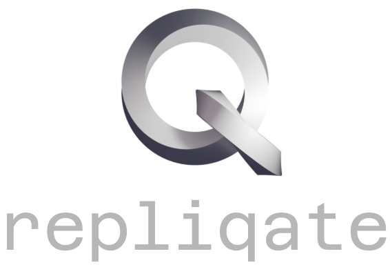

<p align="center">
    
</p>

<p align="center">
    
    
</p>

<p align="center">
    
    
</p>

<p align="center">
    <a href="https://lminlone.github.io/repliqate/">
        
    </a>
</p>

Repliqate is a modular backup solution for Docker environments that ensures data consistency by managing container states during backup operations.

# Key Features
- **Label-based config**: Configure via Docker container/volume labels.
- **Container-safe**: Auto-manages container states during backups.
- **Smart scheduling**: Supports both simple (`@daily 3am`) and cron expressions.
- **Self-hostable**: Runs as a Docker container.

# Quick Start
## Repliqate Container
```yml
services:
  repliqate:
    image: lminlone/repliqate
    container_name: repliqate
    volumes:
      - /var/run/docker.sock:/var/run/docker.sock
      - /path/to/backups:/var/repliqate
      - /var/lib/docker/volumes:/var/lib/docker/volumes
```

## Backup Container Configuration
```yml
services:
  app:
    image: my-app:latest
    labels:
      repliqate.enabled: 'true'
      repliqate.schedule: "@daily 3am" # Trigger every day at 3 am
      repliqate.backup_id: my_app_01
      repliqate.retention: "30d" # Keep backups for 30 days
```

Full documentation here: https://lminlone.github.io/repliqate/

# Contributing
Contributions are welcome. Please open an issue to discuss proposed changes before submitting a pull request.

# License
Repliqate is licensed under the MIT License. See [LICENSE](License.md)